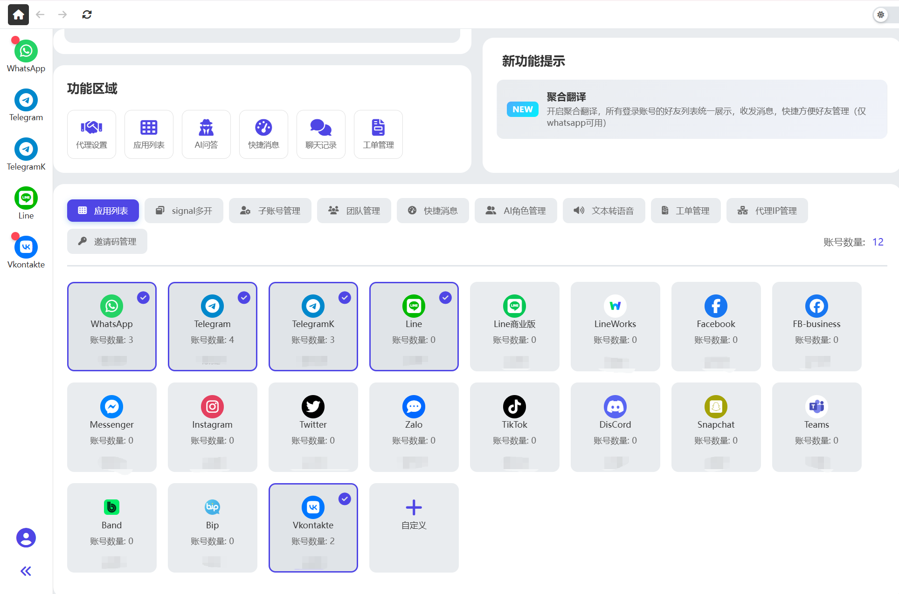
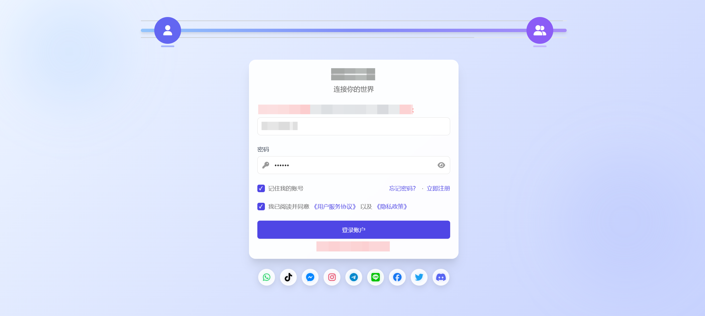
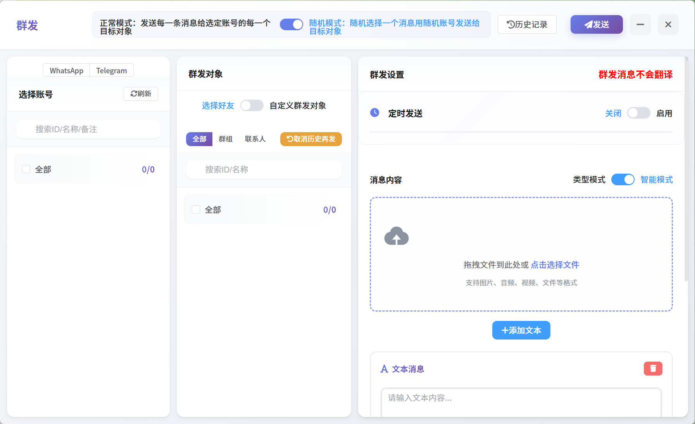
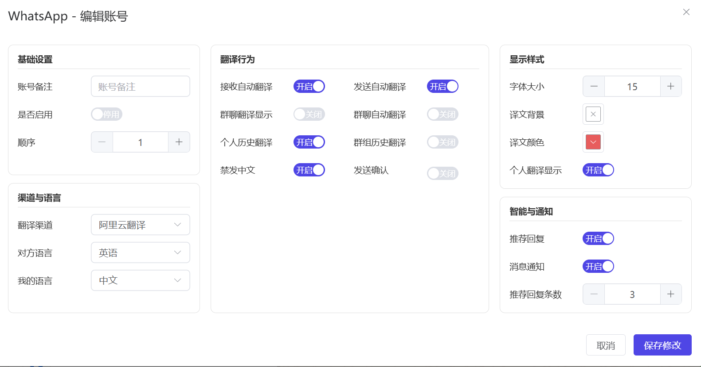
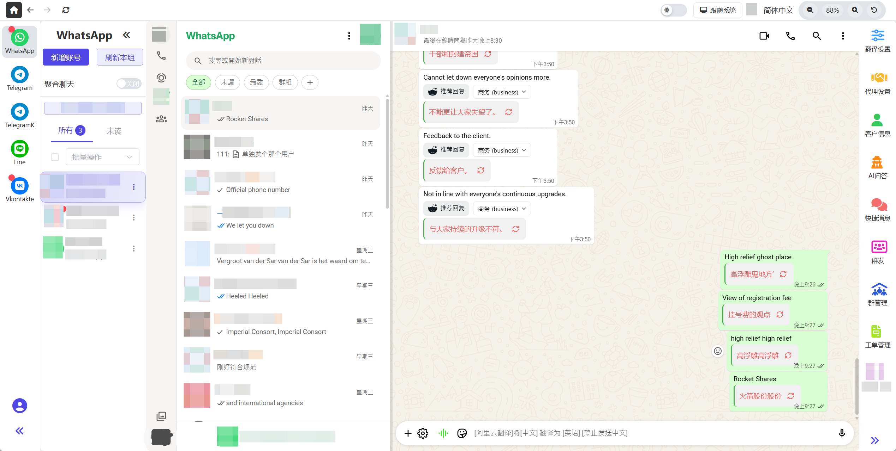

# 概览
出海社交应用多开聚合翻译系统，WhatsApp/Line/Zalo/telegram/facebook/tiktok所有市面主流聊天软件自动翻译，工单进粉统计，支持独立ip代理，群发功能，多开子账号，快捷消息，AI角色推荐回复，AI找话题里聊天不冷场，软件多开；聚合翻译，支持各国文字消息转语音消息发送，客户备注，一键群管理，全套源码及后台管理系统，拥有同市面上成熟运营的同类软件一样的所有功能完整源码，极其稳定，可直接开始运营

## 主界面

## 登录界面

## 群发功能

## 翻译控制设置

## 聊天自动翻译

## 联系方式
**有意联系**
- Telegram
 [ @tranlico](https://t.me/Tranlico)

